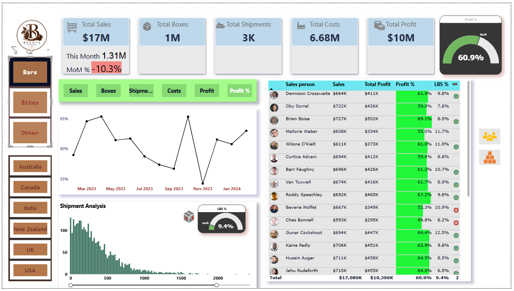
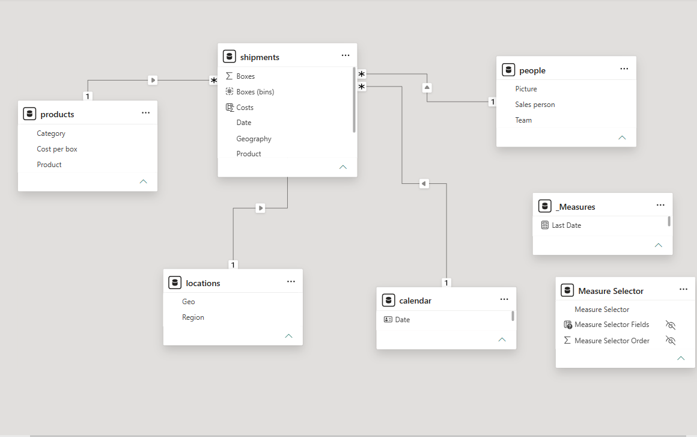

# 🍫 Chocolate Brand Global Sales Intelligence Dashboard

<p align="center">
  
  
  
  
  
  
</p>

---

## 📌 Problem Statement

A multi-national chocolate brand operating across 6 countries (Australia, Canada, India, New Zealand, UK, USA) and 3 product categories (Bars, Bites, Other) needed a unified executive dashboard to monitor sales performance, profitability, and shipment efficiency.

The business needed answers to three questions:
1. **Are we growing or declining month-over-month** across sales, costs, and profit?
2. **Which salespeople and geographies are over/under-performing** against profit targets?
3. **How are shipment volumes and box counts trending**, and where should we focus inventory?

This dashboard provides a **single source of truth** for all commercial KPIs — built on a clean star-schema data model with full DAX time-intelligence.

---

## 📊 Dashboard Preview

> Multi-page Power BI report with dynamic Measure Selector, KPI cards, trend lines, and salesperson scorecards

<p align="center">
  
</p>


<p align="center">
  
</p>

---

## 📁 Dataset

| Field | Detail |
|---|---|
| **Source** |  Dataset (fictional chocolate brand) |
| **Shipments Table** | 6,113 rows — Sales Person, Geography, Product, Date, Sales ($), Boxes, Costs ($) |
| **People Table** | 25 rows — Sales Person, Team |
| **Products Table** | 22 products — Category, Cost per Box |
| **Locations Table** | 6 geographies — Region |
| **Calendar Table** | Full date dimension for time-intelligence |
| **Date Range** | January 2023 — January 2024 |

---

## 🔑 Key Business Insights

- 💰 **Total Sales: $17.1M** | **Total Profit: $10.4M** | **Profit Margin: 60.9%** across 1M+ boxes and 3K shipments
- 📉 **MoM Sales Change: -10.3%** in the latest month — flagging a potential seasonal dip requiring investigation
- 🏆 **Top performer: Brien Boise** — 69.1% profit margin, $502K total profit; lowest: Ches Bonnell at 49.8%
- 🌍 **Multi-geography analysis** reveals consistent profitability across all 6 markets, with shipment volumes highest in Canada and USA
- 📦 **LBS % (Low Box Shipments): 9.4%** — tracking small-order inefficiency to inform minimum order quantity policy

---

## 🏗️ Data Model (Star Schema)

```
        [Calendar]
            |
[Locations] ─── [Shipments] ─── [People]
                     |
                [Products]
                     |
             [Measure Selector]   ← dynamic KPI switcher
             [_Measures]          ← all DAX measures
```

**Relationships:**
- `Shipments[Date]` → `Calendar[Date]` (many-to-one)
- `Shipments[Geography]` → `Locations[Geo]` (many-to-one)
- `Shipments[Product]` → `Products[Product]` (many-to-one)
- `Shipments[Sales Person]` → `People[Sales Person]` (many-to-one)

---


## 🛠️ Tools & Technologies

| Layer | Tool |
|---|---|
| Data Source | Excel (.xlsx) |
| Data Modeling | Power BI (Star Schema, 5 tables) |
| Measures & KPIs | DAX (Time Intelligence, MoM, Ratios) |
| Visualization | Power BI Desktop |
| Dynamic Filtering | Measure Selector (Field Parameter) |
| Version Control | Git + GitHub |

---

## ▶️ How to Run

### Power BI Dashboard
1. Download `Sales_Analysis_PowerBI.pbix` from this repository
2. Open with **Microsoft Power BI Desktop** (free — [download here](https://powerbi.microsoft.com/desktop/))
3. If the data source connection fails:
   - Go to **Home → Transform Data → Data Source Settings**
   - Update the file path to point to your local `data/` folder
   - Click **Close & Apply**
4. Navigate between pages using the **bottom tabs**: Page 2 (Sales Report) → Trend Tooltip
5. Use the **category filter buttons** on the left (Bars / Bites / Other) and **geography slicers** to drill down
6. Use the **Measure Selector buttons** (Sales / Boxes / Shipments / Costs / Profit / Profit %) to switch KPI views dynamically

### Exploring the Data Model
1. In Power BI Desktop, click the **Model view** icon on the left sidebar (3rd icon)
2. You'll see the full star schema with all 5 tables and relationships
3. To inspect DAX measures, click **_Measures** table → view each measure in the formula bar

---

## 📂 Project Structure

```
Sales-Analytics-Dashboard/
├── Sales_Analysis_PowerBI.pbix     # Full Power BI report
├── data/
│   ├── shipments.xlsx              # Main fact table (6,113 rows)
│   ├── people.xlsx                 # Sales team dimension
│   ├── products.xlsx               # Product dimension
│   └── locations.xlsx              # Geography dimension
├── screenshots/
│   ├── sales_report.png
│   ├── trend.png
│   └── data_model.png
└── README.md
```

---

## 💡 Business Recommendations

1. **Investigate MoM -10.3% sales dip** — Cross-reference with shipment volume and check whether it's driven by one geography or product category
2. **Coach low-margin salespeople** — Ches Bonnell (49.8%) and Beverie Moffet (52.3%) are below the 60% profit target; pricing or discount discipline training recommended
3. **Reduce LBS % below 7%** — Enforce minimum box quantity per order in low-performing geographies to improve shipment efficiency

---

## 👩‍💻 Author

**Tanu Shree**  
B.Tech, IIT (ISM) Dhanbad | CGPA: 8.96  
[LinkedIn](https://linkedin.com/in/tanu-shree09) • [GitHub](https://github.com/tanu99C)
